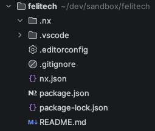

#  Atelier 1 : Créer son premier workspace Nx

## 1. Installer Nx CLI globalement

```bash
npm install -g nx
```

Cela permet d'avoir la commande `nx` disponible globalement pour 
exécuter les différentes tâches sur notre workspace.

## 2. Créer un nouveau workspace Nx

Commençons par créer un workspace Nx vide. Pour cela, ouvrez votre terminal et exécutez la commande suivante :

```bash
npx -y create-nx-workspace@latest --name my-workspace --preset apps --nxCloud skip
```

Vous devriez obtenir une structure de dossier similaire à celle-ci :



## 3. Ouvrir le workspace dans votre éditeur de code

Ouvrez le dossier `my-workspace` dans votre éditeur de code préféré.

VSCode et WebStorm possèdent tous deux une intégration Nx pour faciliter le développement.
* [Nx pour VSCode](https://marketplace.visualstudio.com/items?itemName=nrwl.angular-console)
* [Nx pour WebStorm](https://plugins.jetbrains.com/plugin/21060-nx-console)

## 4. Ajouter le plugin React

On ajoute d'abord le plugin React à notre workspace Nx :

```bash
nx add @nx/react
```

Cela devrait installer les dépendances nécessaires et configurer le workspace pour React.
```
 NX   Package @nx/react added successfully.
```

## 5. Générer une application

Maintenant qu'on a le plugin d'installé, on peut générer une application

> [!NOTE]
> Rappel : Nx utilise le concept de generators pour générer du code 
> (applications, libs, composants...).
> La syntaxe est : `nx generate ${plugin}:${generator} [options]` (ou `nx g` en version courte).

Générons une application React avec Vite et SCSS :

```bash
nx g @nx/react:app apps/my-app--bundler vite --routing --style scss --linter eslint --unitTestRunner jest --e2eTestRunner none --port 4200
```

> [!TIP]
> Il est également possible de simplement exécuter `nx g @nx/react:app` et de 
> laisser le CLI nous poser des questions pour configurer l'application.

## 6. Lancer l'application

> [!TIP]
> Rappel: Nx utilise le concept de **targets** pour exécuter des tâches spécifiques
> sur un projet (serve, build, test, ...)
> La syntaxe est : `nx run ${app-name}:${target}` (ou simplement `nx ${target} ${app-name}`).

Pour voir toutes les targets disponibles pour l'application qu'on vient de générer, lancez :
```
nx show project my-app --web
```

Enfin, lancez l'application en mode développement pour vérifier que tout fonctionne :
```bash
npx nx serve my-app
```