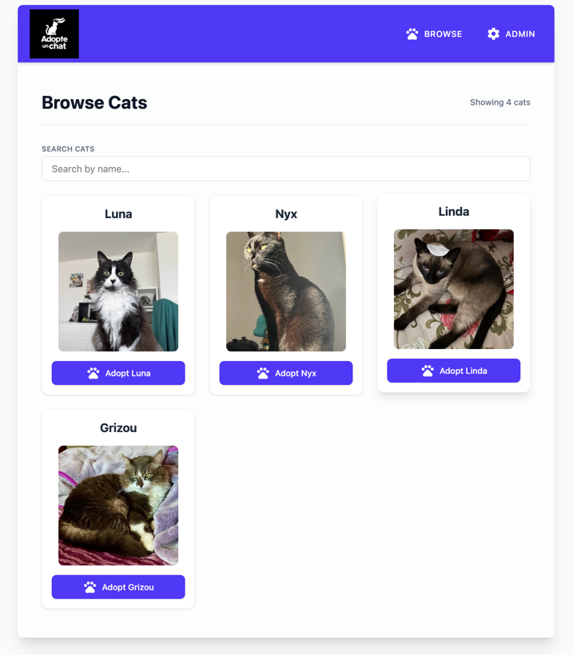
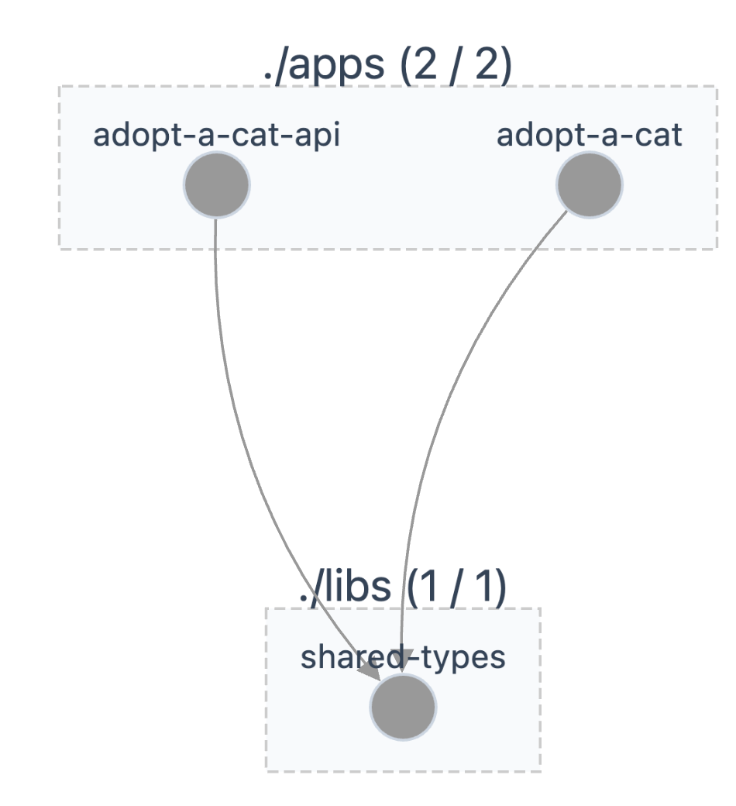

# Atelier 3 : Partager du code

Pour la suite des ateliers, nous allons nous baser sur un project fictif d'adoption de chats. C'est une application 
React qui affiche une liste de chats disponibles à l'adoption, et une API NestJS qui fournit les données de ces chats.



## 1. Problématique

Les deux applications (back et front) sont indépendantes. Chaque app duplique l'interface `Cat`. Si le backend change 
cette interface, nous devrons mettre à jour manuellement le frontend, ce qui peut entraîner des erreurs en cas d'oubli.

Nous allons créer une librairie partagée pour partager nos interfaces.

## 2. Fork du projet

Pour gagner du temps et suivre les étapes de cet atelier, clonez et installez ce repository de départ : 
https://github.com/Lil-Isma/felitech

## 3. Générer une librairie TypeScript

Nous allons utiliser le générateur `@nx/js` pour créer une librairie simple (sans framework spécifique) nommée `shared-types`.

```bash
nx add @nx/js
nx generate @nx/js:lib libs/shared-types --bundler vite --linter eslint --unitTestRunner jest
```

Vous verrez un nouveau dossier apparaître : `libs/shared-types`.

## 4. Créer une Interface partagée

Ajouter une interface ou un type `Cat` dans la nouvelle library, puis 
l'exporter depuis `libs/shared-types/src/index.ts` pour qu'elle soit accessible.

```typescript
// index.ts
export type { Cat } from './lib/cat';
```

## 5. Utiliser la librairie dans le backend et frontend

Modifiez le service NestJS et l'application React pour utiliser cette interface spécifique.

Pour l'importer, plutôt que d'utiliser un chemin relatif, utilisez le chemin de la librairie partagée.

```typescript
import { Cat } from '@felitech/shared-types';
```

> [!NOTE]
> **Comment ça marche ?**
> Lorsque vous avez généré la library, Nx a automatiquement ajouté cet alias 
> (`@felitech/shared-types`) dans la propriété `paths` de `tsconfig.base.json` à la 
> racine de votre projet. C'est grâce à cela que TypeScript sait où trouver le code.

## 6. Visualiser le changement dans le Graph

Nx lit tous vos fichiers TypeScript pour identifier les imports et construire un graphe de dépendances. Cela permet de 
voir clairement quelles applications ou librairies dépendent les unes des autres.

Lancez la commande :

```bash
nx graph
```

Une page web s'ouvre. Vous verrez clairement que l'application React ET l'API dépendent
toutes les deux de `shared-types`.



## 6. Vérification 

Si vous relancez vos applications (nx run-many -t serve ...), tout devrait fonctionner. 

Avantage : si on modifie l'interface dans `libs/shared-types`, TypeScript nous alerte instantanément d'une erreur 
dans le Backend ET dans le Frontend lors de la compilation.