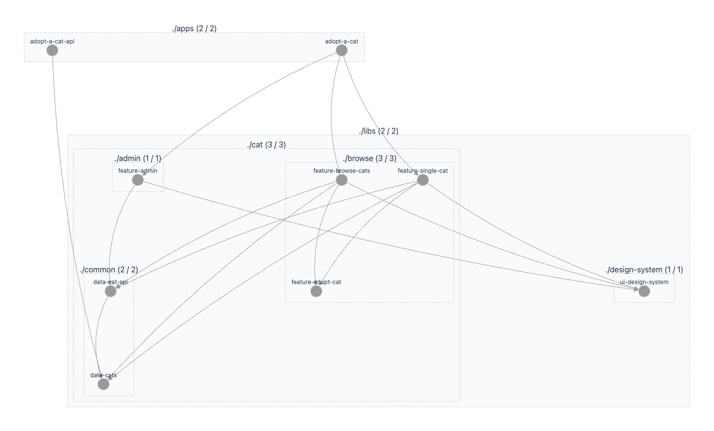

# Atelier 7 : Organiser son code

> [!NOTE]
> Débutez par la branche `main` pour cet atelier

Nous allons refactorer notre code pour suivre l'Angular Entreprise Monorepo pattern, qui est une approche 
recommandée pour organiser les projets dans un monorepo Nx.

## 1. Comprendre l'architecture cible

Actuellement, la logique réside entièrement dans `apps/adopt-a-cat`. Dans un projet Nx mature, les applications doivent 
être des "coquilles vides" qui ne font qu'assembler des fonctionnalités.

Nous allons découper le code en 4 types de librairies :
* **Feature** : Contient des "Smart Components" (ex: la page complète de liste de chats).
* **Data** : Contient la gestion des données externes (API calls, models partagés).
* **UI** : Contient des "Dumb Components" réutilisables (ex: `PageHeader`, `StarRating`).
* **Utils** : Fonctions utilitaires pures.

Au final le graph doit ressembler à cela :



## 2. Stratégie de migration "low hanging fruits"

Ne commencez pas par extraire les grosses fonctionnalités (pages complètes).
Il faut procéder en approche *bottom-up* : commencez par les plus petites 
briques (ex: le design system, la library avec les modèles partagés avec le backend), 
puis remontez progressivement vers les pages.

### Commande pour créer une library React

```bash
nx g @nx/react:lib libs/design-system/ui-design-system --bundler vite --component=false --linter eslint --unitTestRunner jest
```

### Commande pour créer une library TypeScript

```bash
nx g @nx/js:lib libs/cat/common/data-cat-api
```
